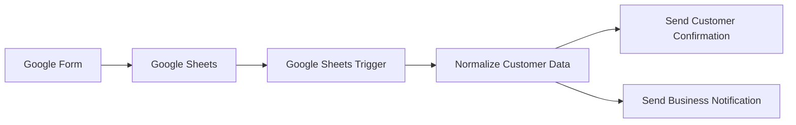

# Proyecto 01 — Automatización de Solicitudes de Clientes

🌐 [English](README.md) | **Español**

## Descripción

Este proyecto automatiza la recepción y el seguimiento inicial de solicitudes enviadas por clientes.

Una persona envía un Google Form, la respuesta se almacena en Google Sheets y un workflow de n8n autoalojado detecta cada nueva fila. El flujo normaliza los datos y después se divide en dos acciones automáticas:

1. Envía un correo de confirmación personalizado al cliente.
2. Envía una notificación interna al negocio.

El workflow fue probado de punta a punta y se ejecuta automáticamente una vez publicado en n8n.

## Arquitectura



## Workflow


## Tecnologías

| Herramienta | Función |
|---|---|
| n8n | Orquestación del workflow |
| Docker / Docker Compose | Entorno autoalojado de n8n |
| Google Forms | Captura de solicitudes |
| Google Sheets | Almacenamiento de respuestas |
| Gmail | Envío automatizado de correos |
| Google Cloud | Autenticación OAuth2 y acceso a APIs |

## Lógica del Workflow

### 1. Google Sheets Trigger

El workflow consulta la hoja de respuestas cada minuto y se activa cuando detecta una nueva fila.

### 2. Normalize Customer Data

Los campos provenientes de Google Forms se transforman a una estructura interna consistente:

| Campo de origen | Campo interno |
|---|---|
| `Name` | `customer_name` |
| `Email` | `customer_email` |
| `Phone` | `customer_phone` |
| `Message` | `customer_message` |
| `Timestamp` | `submitted_at` |

Esta capa de normalización desacopla el resto del workflow de la estructura externa del formulario.

### 3. Send Customer Confirmation

Se envía un correo HTML personalizado a la dirección proporcionada por el cliente. El contenido usa expresiones dinámicas de n8n para insertar el nombre y el mensaje recibido.

### 4. Send Business Notification

Una segunda rama envía una notificación interna con nombre, correo, teléfono, mensaje y fecha/hora de envío.

## Conceptos Demostrados

- Automatización orientada a eventos
- Triggers basados en polling
- Autenticación OAuth2
- Integración con APIs de Google
- Mapeo y normalización de datos
- Expresiones dinámicas de n8n
- Ramificación / fan-out
- Envío automatizado de correos HTML
- Self-hosting con Docker
- Persistencia de datos de n8n
- Sanitización de workflows para repositorios públicos

## Autenticación y Seguridad

Google Sheets y Gmail se conectan mediante credenciales OAuth2 configuradas en Google Cloud.

Los secretos **no** se incluyen en este repositorio. El workflow público fue sanitizado y omite intencionalmente:

- Credenciales OAuth
- Client secrets
- Tokens
- Correos personales
- Identificadores reales de Google Sheets
- Metadatos específicos de la instancia de n8n

## Pruebas

La prueba final de punta a punta confirmó que:

- Una nueva respuesta de Google Forms se almacenó en Google Sheets.
- n8n detectó automáticamente la nueva fila.
- Los datos del cliente fueron normalizados.
- Se envió automáticamente el correo de confirmación.
- Se envió automáticamente la notificación interna.
- No fue necesaria una ejecución manual del workflow.

## Valor para el Negocio

Este patrón puede reducir tareas administrativas repetitivas en organizaciones que reciben solicitudes mediante formularios en línea.

Casos de uso posibles:

- Servicios profesionales
- Consultoría
- Solicitudes de citas
- Educación
- Atención al cliente
- Pequeños negocios
- Captura de leads

La misma arquitectura puede ampliarse con CRM, lead scoring, clasificación con IA, SMS/WhatsApp o enrutamiento automático.

## Estructura del Repositorio

```text
proyecto-01-forms-sheets-email/
│
├── README.md
├── README.es.md
├── setup-guide.md
├── case-study.md
├── .gitignore
│
├── workflows/
│   ├── README.md
│   └── project-01-customer-inquiry-automation.json
│
├── assets/
│   ├── README.md
│   └── 03-n8n-workflow.png
│
└── deployment/
    ├── README.md
    ├── docker-compose.example.yml
    └── .env.example
```

## Workflow Exportado

El workflow sanitizado se encuentra en:

`workflows/project-01-customer-inquiry-automation.json`

Después de importarlo, cada usuario debe configurar:

- Su propio documento de Google Sheets
- La pestaña/hoja correspondiente
- Sus credenciales OAuth2 de Google
- El correo interno de notificación

## Instalación

Consulta [setup-guide.md](setup-guide.md) para el procedimiento completo.

## Caso de Estudio

Consulta [case-study.md](case-study.md) para revisar el problema, la implementación, la validación, las limitaciones y las mejoras futuras.

## Mejoras Futuras

- Validación de correo electrónico
- Detección de solicitudes duplicadas
- Clasificación de solicitudes con IA
- Integración con Salesforce o HubSpot
- Lead scoring
- Notificaciones por SMS / WhatsApp
- Manejo de errores y reintentos
- Logging y monitoreo centralizado
- Despliegue en la nube para disponibilidad 24/7

## Estado

**Completado y probado de punta a punta ✅**
