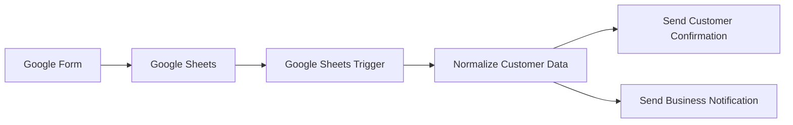

# Project 01 — Customer Inquiry Automation

🌐 **English** | [Español](README.es.md)

## Overview

This project automates the intake and follow-up process for customer inquiries.

A customer submits a Google Form, the response is stored in Google Sheets, and a self-hosted n8n workflow detects each new row. The workflow normalizes the incoming data and then branches into two automated actions:

1. A personalized confirmation email is sent to the customer.
2. An internal notification email is sent to the business.

The workflow was tested end-to-end and runs automatically after being published in n8n.

## Architecture



## Workflow


## Tech Stack

| Tool | Role |
|---|---|
| n8n | Workflow orchestration |
| Docker / Docker Compose | Self-hosted n8n environment |
| Google Forms | Customer inquiry capture |
| Google Sheets | Response storage |
| Gmail | Automated email delivery |
| Google Cloud | OAuth2 authentication and API access |

## Workflow Logic

### 1. Google Sheets Trigger

The workflow polls the Google Sheets response table every minute and starts when a new row is added.

### 2. Normalize Customer Data

The incoming Google Forms fields are mapped to a consistent internal structure:

| Source field | Internal field |
|---|---|
| `Name` | `customer_name` |
| `Email` | `customer_email` |
| `Phone` | `customer_phone` |
| `Message` | `customer_message` |
| `Timestamp` | `submitted_at` |

This normalization layer decouples the downstream workflow from the external form schema.

### 3. Send Customer Confirmation

A personalized HTML confirmation email is sent to the address submitted in the form. The email uses dynamic n8n expressions for the customer name and inquiry message.

### 4. Send Business Notification

A second branch sends an internal notification containing the customer name, email, phone, message, and submission timestamp.

## Concepts Demonstrated

- Event-driven workflow automation
- Polling-based triggers
- OAuth2 authentication
- Google API integration
- Data mapping and normalization
- Dynamic n8n expressions
- Workflow branching / fan-out
- Automated HTML email delivery
- Docker-based self-hosting
- Persistent n8n storage
- Public workflow sanitization

## Authentication and Security

Google Sheets and Gmail are connected through Google OAuth2 credentials configured in Google Cloud.

Secrets are **not** included in this repository. The public workflow export is sanitized before being committed and intentionally omits:

- OAuth credentials
- Client secrets
- Tokens
- Personal email addresses
- Live Google Sheet identifiers
- Instance-specific n8n metadata

## Testing

The final end-to-end test verified that:

- A new Google Forms submission was stored in Google Sheets.
- n8n automatically detected the new row.
- Customer data was normalized.
- The customer confirmation email was sent automatically.
- The internal business notification was sent automatically.
- No manual workflow execution was required.

## Business Value

This pattern can reduce repetitive administrative work for organizations that receive inquiries through online forms.

Potential use cases include:

- Professional services
- Consulting
- Appointment requests
- Education
- Customer support
- Small businesses
- Lead capture

The same architecture can later be extended with CRM integration, lead scoring, AI classification, SMS/WhatsApp notifications, or automated routing.

## Repository Structure

```text
proyecto-01-forms-sheets-email/
│
├── README.md
├── README.es.md
├── setup-guide.md
├── case-study.md
├── .gitignore
│
├── workflows/
│   ├── README.md
│   └── project-01-customer-inquiry-automation.json
│
├── assets/
│   ├── README.md
│   └── 03-n8n-workflow.png
│
└── deployment/
    ├── README.md
    ├── docker-compose.example.yml
    └── .env.example
```

## Workflow Export

The sanitized n8n workflow is available at:

`workflows/project-01-customer-inquiry-automation.json`

After importing it, configure your own:

- Google Sheets document
- Sheet/tab
- Google OAuth2 credentials
- Internal notification email

## Setup

See [setup-guide.md](setup-guide.md) for the complete configuration process.

## Case Study

See [case-study.md](case-study.md) for the problem, implementation, validation, limitations, and next steps.

## Future Improvements

- Email validation
- Duplicate inquiry detection
- AI-based inquiry categorization
- Salesforce or HubSpot integration
- Lead scoring
- SMS / WhatsApp notifications
- Error handling and retry workflows
- Centralized logging and monitoring
- Cloud deployment for 24/7 availability

## Status

**Completed and tested end-to-end ✅**
